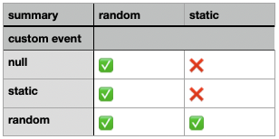

This repository reproduces a bug in [Kalend](https://github.com/nibdo/kalend), an otherwise great calendar component for React

# Instructions
1. Clone and cd into repository
2. Start application
```sh
$ yarn install --frozen-lockfile
$ yarn start
```
3. Check browser console
4. Open this project in a code editor and navigate to the `TODO:` to reproduce any of the scenarios from the test matrix


# Notes
The issue seems to be related to [Custom events](https://docs.kalend.org/docs/basics/customEvents). My takeaway is that when using custom events, two events which share the same summary, **must** provide unique content through their custom rendering. If they fail to do so, Kalend crashes due to `Uncaught RangeError: Maximum call stack size exceeded` in `dequal`. Perhaps related to [dequal#19](https://github.com/lukeed/dequal/issues/19)

# Test matrix
